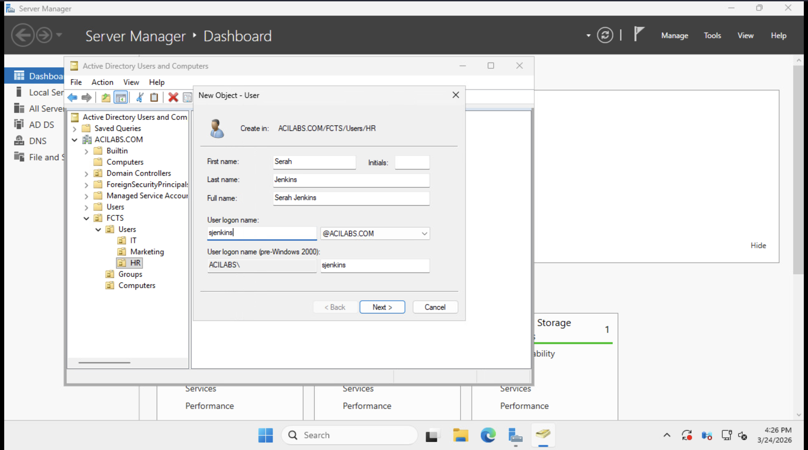
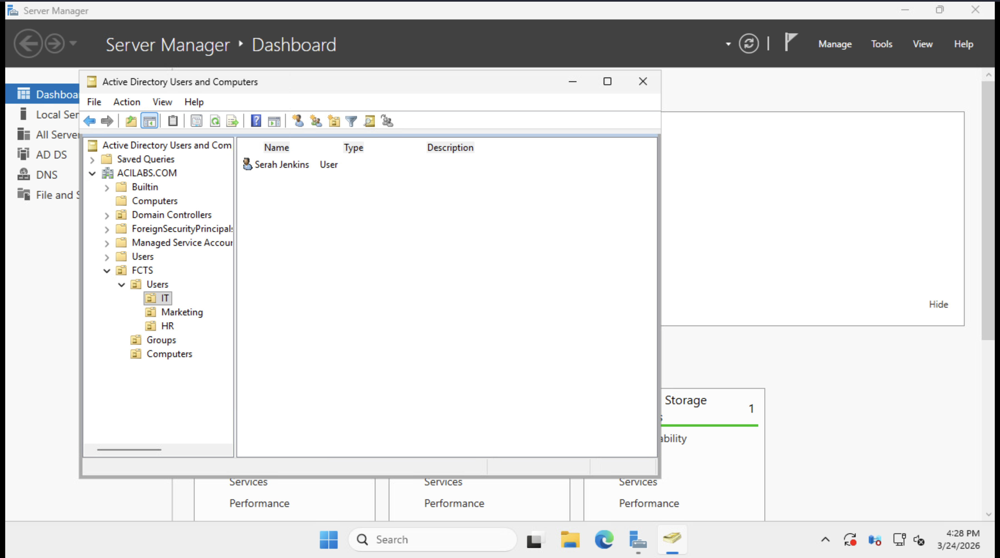
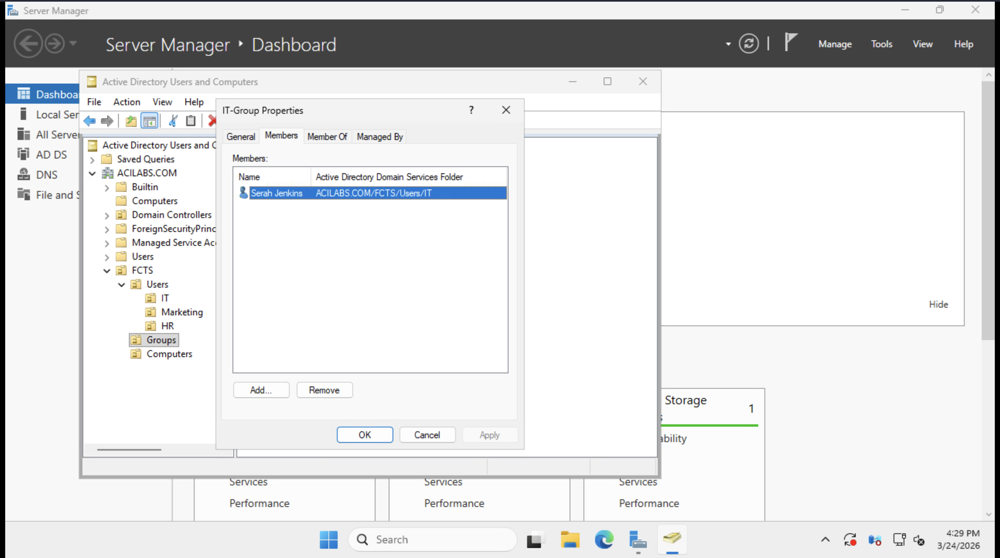
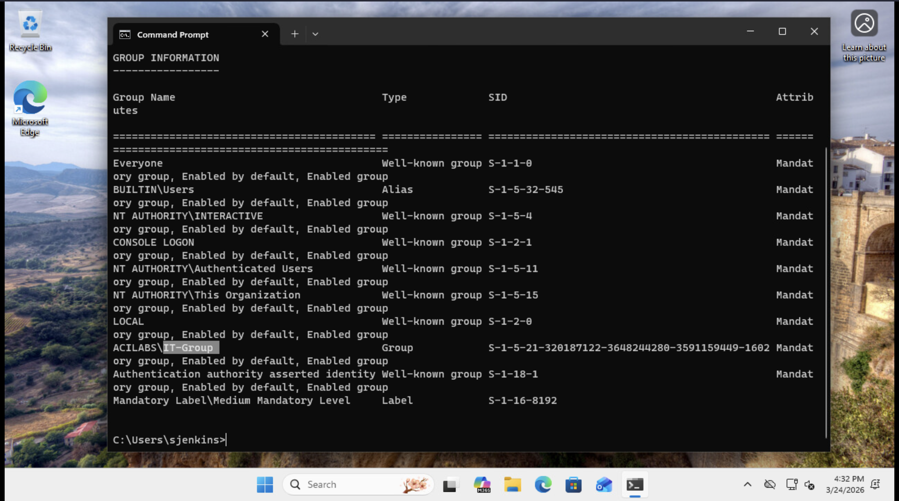

# 🛠️ Active Directory User Lifecycle & Ticketing Project

## 📋 Project Overview
This project simulates a real-world enterprise IT environment using the **JobSkillShare (JSS)** professional lab sandbox. I designed and implemented a tiered **Organizational Unit (OU)** structure from scratch to manage the full user lifecycle while resolving common Help Desk tickets.

---

### 💻 Environment & Tools
| Component | Specification |
| :--- | :--- |
| **Lab Environment** | JobSkillShare (JSS) IT Pro Sandbox |
| **Domain Controller** | Windows Server 2022 |
| **Client Workstation** | Windows 11 Pro (Domain Joined) |
| **Domain Name** | `ACILABS.COM` |
| **Organization Name** | Forest City Tech Solutions (FCTS) |

---

## 📂 Active Directory Design (OU Structure)
I built a professional, scalable hierarchy under the FCTS root OU to ensure the directory stays organized as the company grows:

```text
ACILABS.COM (Root)
└── FCTS (Top Level OU)
    ├── Groups (Security Groups)
    ├── Users (Employee Accounts)
    │   ├── IT
    │   ├── HR
    │   └── Marketing
    └── Computers (Workstations)
```


---

 ## 🎫 Help Desk Ticket Simulation


### 🟢 Ticket 1: New Hire Provisioning & Security Onboarding

> **Scenario:** A new hire, **Sarah Jenkins (sjenkins)**, joined the IT department. My goal was to set up her account following the company’s security and folder structure.

#### **Technical Actions:**
* **Implementation:** Created the user object `sjenkins` within the **FCTS > Users > IT** Organizational Unit. This ensures she automatically receives the correct department settings based on her physical location in the directory.
* **Access Control:** Established a **Global Security Group** named `IT-Group` within the **Groups** OU to facilitate Role-Based Access Control (RBAC).
* **Security Policy:** Enforced the `User must change password at next logon` requirement. This aligns with industry-standard security protocols, ensuring the Administrator has zero knowledge of the user’s permanent credentials.
* **Verification:** Successfully authenticated as `sjenkins` on the **Windows 11 Client**. Executed `whoami /groups` to verify that the IT-Group Security Identifier (SID) was correctly added to the user's Kerberos access token.

#### **📸 Technical Evidence:**

**1. ADUC Provisioning: Defining the `sjenkins` User Object**

*Defining account name and logon credentials within the targeted IT Organizational Unit.*

**2. Credential Security: Enforcing Mandatory Password Change**

*Configuring initial security flags to ensure user-owned credential privacy.*

**3. RBAC Setup: Creating the `IT-Group` Security Group**

*Setting up the departmental security group for streamlined permission management.*

**4. Policy Verification: Forced Password Change on Client**

*Verifying that the server-side security policy propagated correctly to the Windows 11 workstation.*

**5. Technical Validation: Access Token Group Confirmation**

*Using CLI to confirm the account successfully inherited all IT-Group permissions.*

---

### 🟡 Ticket 2: Identity Recovery & Security Reset

> **Scenario:** **Michael Chen (mchen)** from HR reported a total loss of workstation access. His account was locked out after multiple failed login attempts, triggering the domain's security protection.

#### **Technical Actions:**
* **Security Policy:** Configured an **Account Lockout Threshold** of 3 attempts via the **Default Domain Policy** to protect the environment against brute-force attacks.
* **Diagnostic:** Identified the lockout status on the Domain Controller by navigating to the **Account** tab in ADUC, confirming the user was restricted from authenticating.
* **Resolution:** Performed a secure administrative password reset while clearing the `Unlock the user's account` flag to restore immediate access.
* **Security Maintenance:** Re-enforced the `User must change password at next logon` policy to ensure the new temporary credential was immediately replaced by a private one known only to the user.

#### **📸 Technical Evidence:**

**1. Security Enforcement: Account Lockout Message on Client**

*Verifying the Active Directory security policy successfully blocked access on the Windows 11 workstation.*

**2. Admin Diagnostic: Identifying the Lockout in ADUC**

*Locating the specific lockout flag within the user's account properties on the Domain Controller.*

**3. Technical Resolution: Resetting Password and Unlocking Account**

*Executing the recovery process to restore user access while maintaining administrative zero-knowledge security.*

---

## 🎫 Ticket 3: Security-Focused User Offboarding

**Scenario:** An employee, **James Wilson (jwilson)**, has resigned from the Marketing department. My task was to quickly and securely disable his account to ensure he no longer has access to company files or the network.

---

### 🛠️ 1. How I Secured the Account
In the **Active Directory Users and Computers (ADUC)** console, I followed standard security procedures to lock down the account:

* **Account Disablement:** I right-clicked James’s account and selected **Disable Account**. This immediately stops any new login attempts.
* **Credential Reset:** I reset his password to a random string. This acts as a "double-lock" to make sure his old password cannot be used for any background services or cached logins.
* **Group Cleanup:** I removed his account from the **Marketing-Group**. This ensures that even if the account were re-enabled by mistake, he would no longer have access to private department folders.

---

### 📂 2. Organizing the Directory
To keep the "Active" users separate from people who have left the company, I moved the account to a secure location:

* **OU Migration:** I moved the `jwilson` user object from the **Marketing OU** into a dedicated **Disabled Users** (or "Leavers") OU.
* **Why this matters:** This keeps the Active Directory clean and prevents the system from applying new company policies (GPOs) to an account that is no longer in use.

---

### ✅ 3. Verification & Testing
I confirmed the account was fully locked by performing the following checks:

* **Visual Check:** In ADUC, James’s account icon now shows a **small black downward arrow**, confirming the account is officially disabled.
* **Login Test:** I attempted to log into a **Windows 11 workstation** using the `jwilson` credentials.
* **Result:** The computer blocked the login and displayed the error: *"Your account has been disabled. Please see your system administrator."* This proves the security steps were effective.

---

### 📸 Technical Evidence
| Evidence Type | Description |
| :--- | :--- |
| **1. Account Status** |  |
| **2. OU Migration** |  |
| **3. Security Success** |  |
